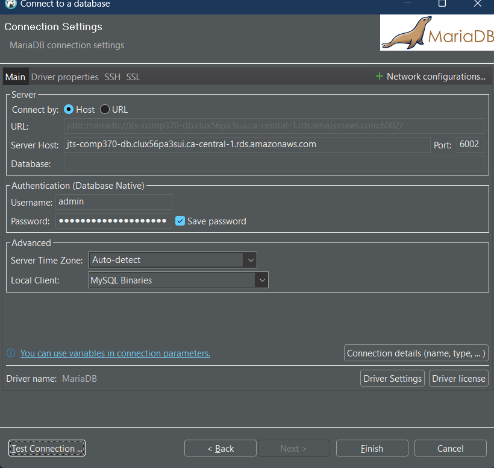

A file that provides the sequence of steps/commands required to setup a functioning database that is accessible from the public internet.

## Creating a MariaDB DB Instance
1. In the AWS Management Console, choose `Services` then select `RDS` under `Database`
2. Choose `Create database` and select `Easy Create`
3. Select `MariaDB`
4. Select `Free tier`
5. Enter a name for the DB instance identifier
6. Enter a master username and password
7. Set up EC2 connection
    i. Select the EC2 instance previously created
8. Select `Create database`
9. Save the user and password

## Modifying Port Number
1. Go to `Security Groups` and select the group corresponding to the DB instance
2. Select `Inbound rules` and `Edit inbound rules`
3. Add a new rule with the following settings:
    i. Type: `Custom TCP`
    ii. Protocol: `TCP`
    iii. Port Range: `6002`
    iv. Source: Security group corresponding to the EC2 instance
4. Select `Save rules`
5. Return to `Security Groups` and select the group corresponding to the EC2 instance
6. Select `Outbound rules` and `Edit outbound rules`
7. Add a new rule with the following settings:
    i. Type: `Custom TP`
    ii. Protocol: `TCP`
    iii. Port Range: `6002`
    iv. Destination: Security group corresponding to the DB instance
8. Select `Save rules`
9. Return to `Databases` and modify the DB instance
10. Under `Connectivity`, select `Additional connectivity configuration`
11. Select `Publicly accessible`
12. Change the port number to `6002`
13. Select `Continue`
14. Select `Modify DB instance`

## Launching MariaDB 
1. Run `sudo apt install mariadb-server`
2. Run `mysql -h [endpoint] -P 6002 -u admin -p` and enter the password
    i. The `endpoint` is retrieved from the AWS Management Console

## Creating a Database
1. In `mysql`, run `CREATE DATABASE [database name];`

## Creating a User and Granting Privileges
1. Run `CREATE USER 'comp370'@'%' IDENTIFIED BY '$ungl@ss3s';`
2. Run `GRANT ALL PRIVILEGES  ON comp370_test.* TO 'comp370'@'%';`
3. Run `FLUSH PRIVILEGES;` to apply the changes

## DBeaver Connection

----

Alternatively, ...

## Launching MariaDB 
1. Run `sudo apt install mariadb-server`
2. Run `sudo mysql_secure_installation`
    i. Create a password for the root user
    ii. Remove anonymous users
    iii. Disallow root login remotely
    iv. Remove test database and access to it
    v. Reload privilege tables now

## Modifying the Port Number
1. Check the status of MariaDB using `sudo service mariadb status`
2. Navigate to `/etc/mysql/mariadb.cnf` and change the port number to `6002`

## Allow access
1. Navigate to `/etc/mysql/mariadb.conf.d/50-server.cnf` and change the bind address to `0.0.0.0`
2. Restart MariaDB using `sudo service mariadb restart`
3. Test access to MariaDB by running `Mariadb -u root -p` and enter the password

## Creating a Database
1. In `mysql`, run `CREATE DATABASE [database name];`

## Creating a User and Granting Privileges
1. Run `CREATE USER 'comp370'@'%' IDENTIFIED BY '$ungl@ss3s';`
2. Run `GRANT ALL PRIVILEGES  ON comp370_test.* TO 'comp370'@'%';`
3. Run `FLUSH PRIVILEGES;` to apply the changes
